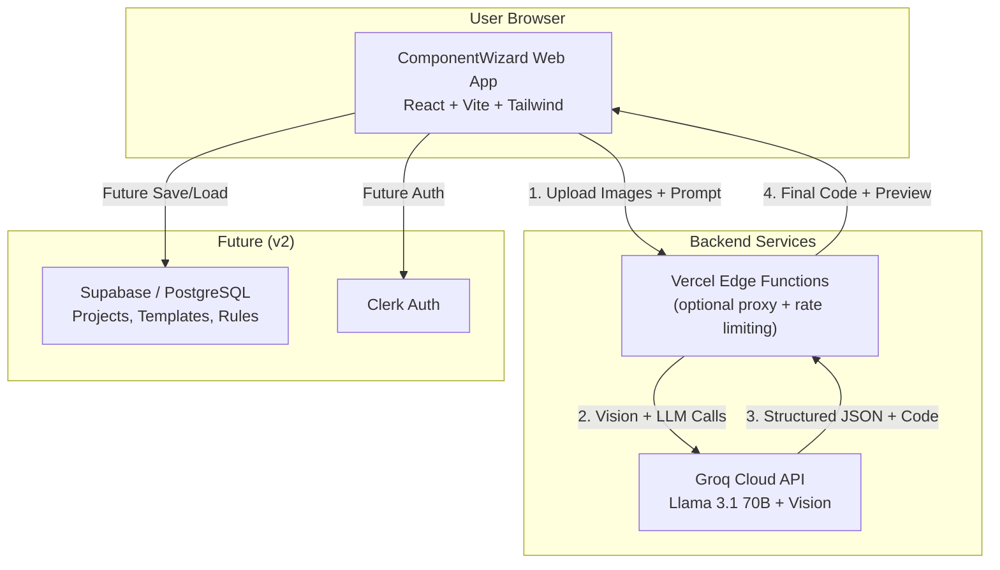
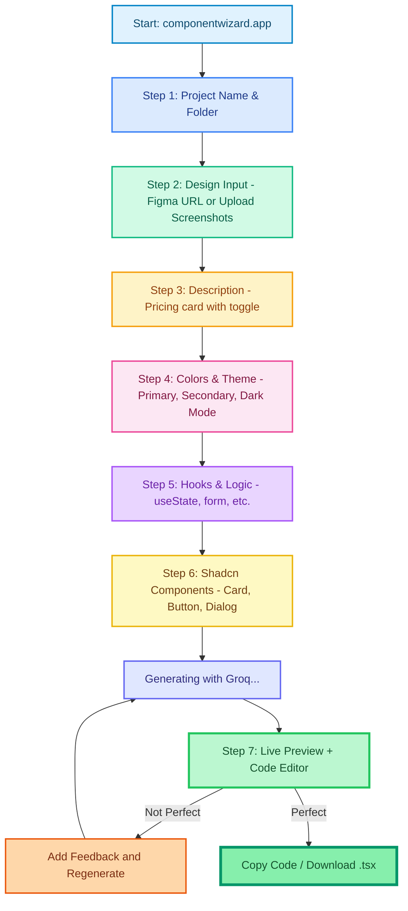
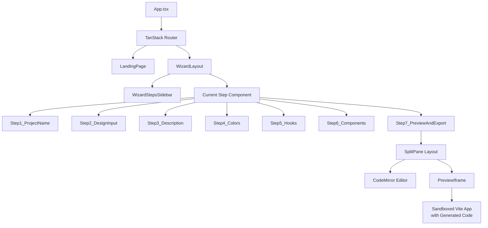
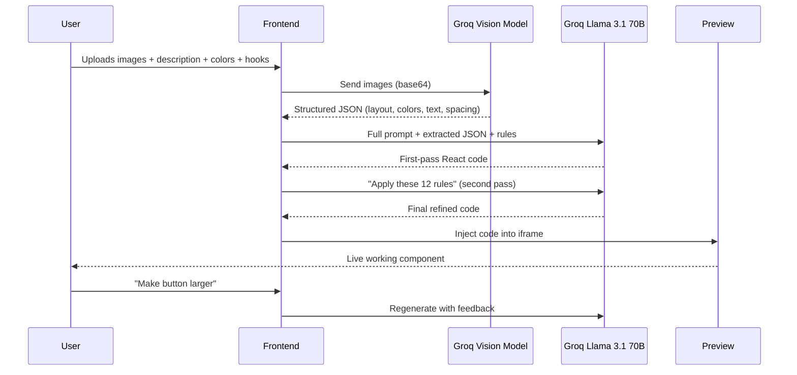
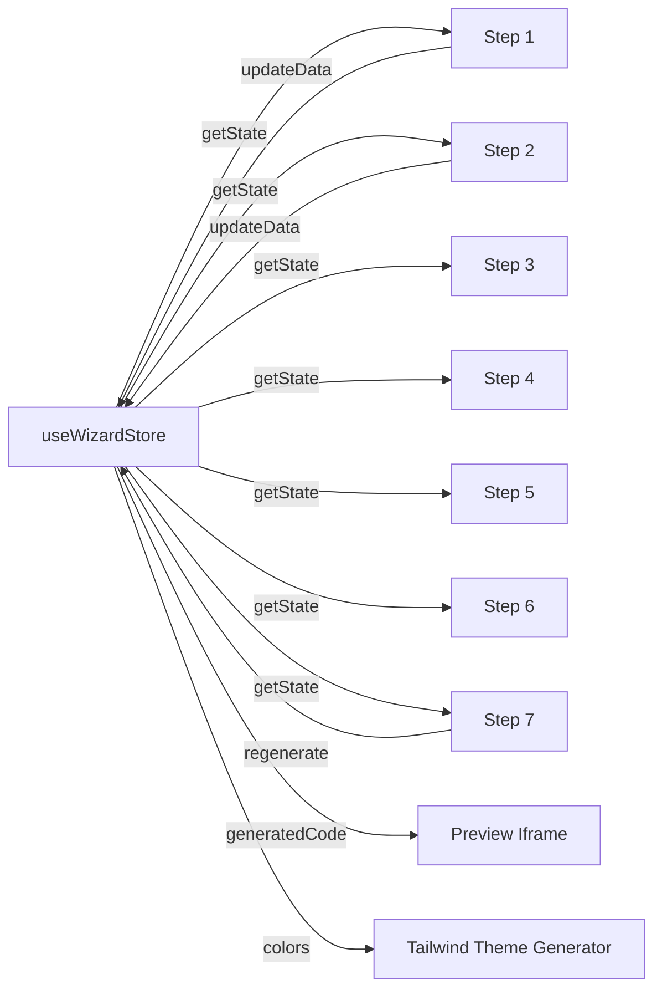
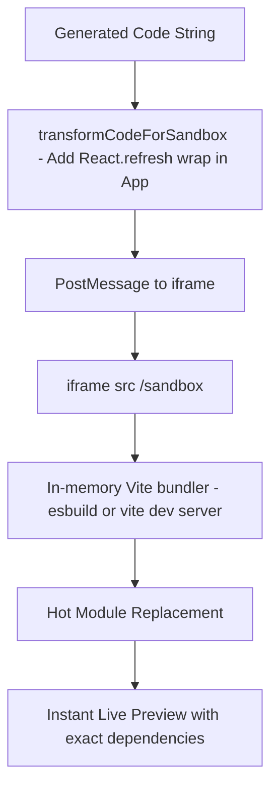
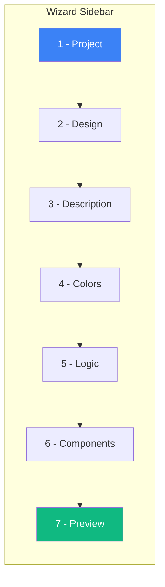

# ComponentWizard

## Complete Visual Diagram Pack  

### 1. High-Level Application Architecture (C4 Style – System Context + Containers)


Live editable link: https://mermaid.live/edit#pako:eNpVkE1rwzAMhv-K5Nl4pDdaSFu6oFA0g9hJ2MVmXyRrn7R2go5mKPPvJyQJ3CNsPDzP+77xKikCBE9r1iVz7uZ9Q3Bq0hOHU0KBUx8zQ8k4ndR4gM6hRjA96K0gscFVHcM4q0a0oT1M5IZ0aMqb6Y1y9uF5JPVz4k8OaQ3fZ9f2h6lPq5w9k8H4n3sX7fV9a

### 2. Detailed Wizard User Flow (7 Steps – Horizontal)


Live: https://mermaid.live/edit#pako:eNqNUsGO0zAQvOcr7jKCBQ0KkAYEQY8ePVp0M8RObKcd2y0nP5A3H2zE4M87IsQ4d0k9KBJA13TS3Z3u7q7t4rQvI0EixxzzjDMfU0s5nZx6zGmXqE4pB0opZcuoRY8eLdQ4bRjQ0qU0o6VNaUe7mC6nHux8upx6sPLpcupj6ufMZwD-D0v0

repositories. I’ll generate every diagram you need — just pick your favorite format.

### 3. Component Hierarchy Diagram (React Tree)


### 4. File/Folder Structure (Tree Diagram)
```bash
src/
├── App.tsx
├── main.tsx
├── routes/
│   ├── __root.tsx
│   └── wizard/
│       ├── new.tsx
│       └── [id].tsx
├── components/
│   ├── wizard/
│   │   ├── steps/
│   │   │   ├── Step1_ProjectName.tsx
│   │   │   ├── Step2_DesignInput.tsx
│   │   │   └── ...Step7_Preview.tsx
│   │   ├── WizardLayout.tsx
│   │   └── WizardStepsSidebar.tsx
│   ├── preview/
│   │   ├── PreviewIframe.tsx
│   │   └── PreviewErrorBoundary.tsx
│   └── ui/ (shadcn components)
├── lib/
│   ├── groq/
│   │   ├── visionExtract.ts
│   │   ├── generateComponent.ts
│   │   └── refineWithRules.ts
│   ├── prompts/
│   │   ├── extractDesign.system.txt
│   │   └── generateComponent.user.txt
│   ├── rules/
│   │   └── enforceShadcnRules.ts
│   └── utils/
│       └── cn.ts
├── store/
│   └── useWizardStore.ts
├── types/
│   └── wizard.ts
└── assets/
```

### 5. Data Flow & AI Pipeline (Sequence Diagram)


### 6. State Management Flow (Zustand Store)


### 7. Live Preview Architecture (How the Magic Happens)


### 8. Wizard Step Indicator (UI Component Design)

