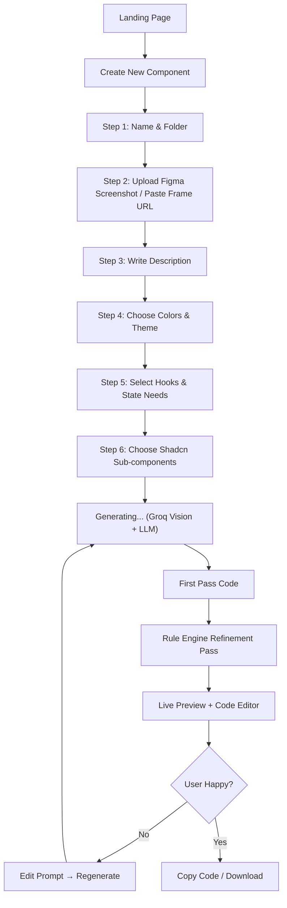

# ComponentWizard – Comprehensive Product Requirements Document (PRD)  
**Version:** 1.0 | **Date:** November 26, 2025  
**Product Vision:** Turn any Figma design + description into a production-ready, accessible, Shadcn-compliant React + TypeScript + Tailwind component in under 5 minutes using a guided AI wizard powered by Groq’s ultra-fast LLMs.

---

### 1. Executive Summary
ComponentWizard is an AI-first, wizard-driven web application that dramatically accelerates the design-to-code handoff. Developers and teams paste a Figma frame (or upload screenshots), write a short description, walk through a 6-step refinement wizard, and receive a fully functional, beautifully styled, accessible React component that drops straight into their codebase.

Built for the modern React + Tailwind + Shadcn stack and powered by Groq’s lightning-fast inference, ComponentWizard is the spiritual successor to v0.dev but with iterative refinement, deep design-system compliance, and a joyful multi-step UX.

---

### 2. Problem Statement
| Pain Point | Current Solutions | Why They Fall Short |
|------------|-------------------|---------------------|
| Manual translation of Figma → React is slow and error-prone | Manual coding, Figma “Inspect” tab | Hours of work, inconsistent spacing, wrong Tailwind classes |
| One-shot AI generators (v0, Cursor, Copilot) | Instant code output | Needs heavy cleanup, ignores Shadcn conventions, poor accessibility, wrong component hierarchy |
| No enforcement of team design system | Custom lint rules (rarely used) | Inconsistent UI across the codebase |
| Junior devs/solo founders blocked on UI | Copy templates, spend days | Kills velocity and momentum |

ComponentWizard solves this with guided iteration, vision understanding, rule-based refinement, and 100% alignment to Shadcn + Tailwind best practices.

---

### 3. Target Audience & Personas
| Persona | Goals | Frustrations |
|--------|-------|--------------|
| Solo Indie Hacker | Ship MVPs in days, not weeks | Stuck on UI for 40%+ of time |
| Full-Stack Developer at Startup | Move fast while keeping UI consistent | Constantly refactoring AI-generated code |
| Small Agency Team | Rapid prototyping for clients | Designers → developers handoff bottleneck |
| Technical Founder | Focus on business logic & growth | Wastes nights pixel-pushing |

---

### 4. Core Value Proposition
“From Figma frame to copy-paste-ready React component in <5 minutes – perfectly styled with Shadcn + Tailwind, accessible, responsive, and following your exact design system.”

---

### 5. MVP Feature Scope (Shippable in 4–6 Weeks)

#### 5.1 Multi-Step Wizard (7 steps)
| Step | Name | Description | Key UI |
|------|------|-------------|-----|
| 1 | Project & Name | Create new project, name the component | Input + preset selector |
| 2 | Design Input | Paste Figma frame URL or upload screenshot(s) | Drag & drop + URL input + multi-image support |
| 3 | Description | Natural language brief (“Pricing card with monthly/yearly toggle and featured badge”) | Rich text area + examples |
| 4 | Color & Theme | Interactive color picker + Shadcn theme generator | Hex picker, palette presets, dark mode toggle |
| 5 | Logic & Hooks | Choose/describe needed hooks & state | Multi-select + free-text custom hooks |
| 6 | Sub-components | Pick Shadcn components to use (Card, Button, Dialog, etc.) | Searchable checkbox list |
| 7 | Generate → Preview → Export | AI generates → live preview → edit → copy/download | Split pane code editor + live preview |

#### 5.2 AI Generation Engine (Groq-powered)
- Vision analysis of uploaded images/Figma screenshots
- Structured extraction → layout, typography, colors, shadows, spacing
- Pattern detection (cards, forms, navbars, dashboards, etc.)
- First-pass code generation using Llama 3.1 70B / Gemma 2 27B / Mixtral
- Rule-based iteration pass (see §6)

#### 5.3 Live Preview & Instant Edit
- Iframe sandbox with Vite HMR
- Side-by-side code + preview
- Click-to-edit props via form (e.g., change button text, toggle dark mode)

#### 5.4 Export Options
- Copy to clipboard (single .tsx file)
- Download as folder (component + types + stories if enabled)
- One-click copy with component folder structure

---

### 6. Rule Engine (The “AI Linter” – What Makes Us Different)
Enforces consistency. Fully configurable via YAML in future; MVP hard-codes best-practice rules:

```yaml
rules:
  - use_shadcn_over_html: true
  - prefer_cn_utility: true
  - require_aria_labels: true
  - mobile_first_breakpoints: true
  - no_inline_styles: true
  - button_variant_mapping:
      primary: primary
      secondary: secondary
      destructive: destructive
      ghost: ghost
  - card_has_proper_padding: true
  - use_radix_slot_where_possible: true
```

The LLM is prompted to apply these rules in a second pass after initial generation.

---

### 7. Detailed User Flow (Mermaid)


---

### 8. Full Technical Stack

| Layer                  | Technology                                      | Reason |
|-----------------------|--------------------------------------------------|--------|
| Frontend              | React 18 + TypeScript + Vite                     | Fastest dev experience |
| UI Library            | shadcn/ui (latest) + Radix Primitives            | Accessible, unstyled, composable |
| Styling               | Tailwind CSS v4 + @tailwindcss/forms            | Utility-first, matches design trends |
| ClassName Utility     | clsx + tailwind-merge (cn function)              | Clean conditional classes |
| AI Provider           | Groq Cloud API (Llama 3.1 70B + vision models)   | <100ms latency, cheapest fast inference |
| State Management      | Zustand (wizard state) + React Context fallback | Lightweight, no boilerplate |
| Forms                 | React Hook Form + Zod                            | Type-safe wizard steps |
| Live Preview          | iframe with Vite dev server in memory            | True hot reload |
| Routing               | TanStack Router or Wouter                        | File-based or lightweight |
| Authentication (v2)   | Clerk (easy social + magic links)                | Future team features |
| Storage (v2)          | Supabase PostgreSQL + Drizzle ORM                | Save projects & templates |
| Hosting               | Vercel (edge functions for Groq proxy if needed) | Instant deploys |
| Analytics             | PostHog (open-source)                            | Understand wizard drop-off |
| Prompt Management     | Custom prompt templates + versioning             | Iterate fast on quality |

---

### 9. Non-Functional Requirements
| Requirement          | Target |
|----------------------|--------|
| Generation latency   | < 8 seconds end-to-end (Groq makes this easy) |
| Vision accuracy      | 90%+ correct layout detection on clean Figma exports |
| Accessibility        | WCAG 2.1 AA compliant output |
| Mobile responsiveness| Mobile-first breakpoints always |
| Uptime               | 99.9% (Vercel + Groq redundancy) |

---

### 10. Success Metrics (First 90 Days)
| Metric                        | Target |
|-------------------------------|--------|
| Avg. time from start → usable component | ≤ 5 minutes |
| User satisfaction (post-generation survey) | ≥ 8.5 / 10 |
| % of generated components needing <10 lines manual fix | ≥ 75% |
| Weekly Active Users           | 1,000 (launch week via indie hacker communities) |
| Conversion to paid (when added) | 15%+ |

---

### 11. Future Roadmap (Post-MVP)

| Phase | Features |
|------|----------|
| 1.1 (1 month) | Regenerate with feedback button, version history |
| 1.2 (2 months)| Direct Figma plugin (select frame → send to ComponentWizard) |
| 2.0 | Team workspaces, shared design tokens & rules |
| 2.1 | Custom component library ingestion |
| 2.5 | GitHub/PR export, Storybook output, Vitest tests generation |
| 3.0 | Full-page generation, animation support (Framer Motion) |

---

### 12. Go-to-Market & Launch Plan
- Launch on IndieHackers, Reddit r/reactjs, Twitter/X (#BuildInPublic)
- Free beta for first 5,000 users
- “Made with ComponentWizard” watermark (removable on paid tier later)
- Early access for top 100 waitlist members

---

This PRD is intentionally written to be consumed by:
- Product Owners/Managers (clear priorities)
- Designers (user flow + wizard UX)
- Developers (exact stack + rules)
- Cursor / other AI coding agents (copy-paste ready architecture)
- Future LLMs (structured, unambiguous requirements)

Let’s ship the fastest, most joyful design-to-code tool the React ecosystem has ever seen.

Ready when you are – just say “Let’s code the first screen”.
